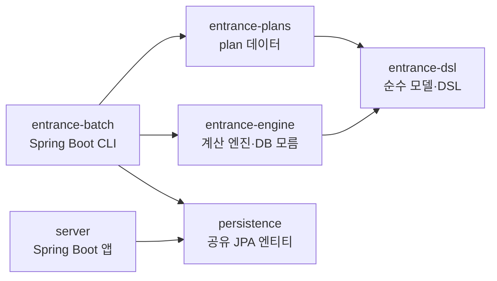

# entrance 모듈 — 입학전형 엔진

이 문서는 `hellogsm-monorepo`에 새로 편입된 **entrance 모듈군**(입학전형 요강을 선언하고
성적 계산·선발·배정을 수행하는 라이브러리)을 처음 접하는 팀원을 위한 안내서다.

> **한 줄 요약**: 요강(요건·배점·정원)을 Kotlin DSL로 **데이터**로 선언하고, 그것을 해석하는
> **순수 엔진**이 성적 계산 → 1·2차 선발 → 학과 배정을 수행한다. 기존 `go-hellogsm`(배치)과
> Lambda 성적 계산기를 대체하는 것이 목표다.

## 목차

| 문서 | 내용 |
|---|---|
| [architecture.md](architecture.md) | 모듈 구조, 의존성 그래프, "엔진은 DB를 모른다"의 의미 |
| [dsl-and-plans.md](dsl-and-plans.md) | 요강을 DSL로 선언하는 법, 새 학년도 plan 추가법 |
| [engine.md](engine.md) | 성적 계산·선발·배정 엔진의 입출력과 도메인 흐름 |
| [batch.md](batch.md) | `entrance-batch` 실행법(CLI), DB↔엔진 매핑, 대조 리포트 |
| [glossary.md](glossary.md) | 도메인 용어집(전형·차수·정원 외·동점자 등) |

## 왜 이렇게 만들었나

입학전형은 매년 요강이 바뀌고, "이 규칙이 왜 이렇게 쓰였나"를 되짚어야 하는 도메인이다.
그래서 두 가지를 분리했다.

- **요강은 데이터** — 배점·정원·동점자 기준 같은 수치는 `entrance-plans`에 선언만 한다. 로직이 없다.
- **엔진은 로직** — 그 데이터를 해석해 계산한다. DB·서버·프레임워크를 전혀 모른다(순수 함수).

이 분리 덕분에 ① 요강 수치는 요강 PDF와 1:1로 대조 가능하고, ② 엔진은 서버 없이도
단위 테스트·Lambda·배치 어디서나 재사용되며, ③ "작년 배치는 어떻게 돌았나"를 과거 plan
파일로 재현할 수 있다.

## 다섯 개 모듈 한눈에

| 모듈 | 역할 | 의존성 | 패키지 루트 |
|---|---|---|---|
| `entrance-dsl` | 도메인 모델 + type-safe builder | 없음(순수 Kotlin) | `kr.hellogsm.entrance.plan` / `.dsl` |
| `entrance-plans` | 현재 활성 요강 선언(`plan`, 고정 이름 — 지난 연도는 `legacy/`) — **데이터만** | `entrance-dsl` | `kr.hellogsm.entrance.plans` |
| `entrance-engine` | 해석 엔진(scoring·evaluation·assignment) | `entrance-dsl` | `kr.hellogsm.entrance.engine.*` |
| `entrance-batch` | DB 러너(go-hellogsm 대체) — Spring Boot CLI | `entrance-engine`·`entrance-plans`·`persistence` | `kr.hellogsm.entrance.batch` |
| `persistence` | 서버·배치 공유 JPA 엔티티 | — | `team.themoment.hellogsmv3.*` |



의존성 화살표가 **한 방향**뿐이라는 점이 핵심이다. `entrance-engine`은 `persistence`·`server`를
가리키지 않는다 — 자세한 이유는 [architecture.md](architecture.md).

## 전체 도메인 흐름

```
원서 접수 ──▶ ① 성적 계산 ──▶ ② 1차 전형(서류) ──▶ ③ 2차 전형(역량검사·심층면접) ──▶ ④ 학과 배정
            (scoring)        (evaluate FIRST)      (evaluate SECOND)              (assign)
                                                                                     │
                                                                          예비합격 / 중도포기 재배정 / 추가모집
```

- ①은 `ScoringEngine`, ②③은 `EvaluationEngine`, ④는 `AssignmentEngine`이 담당한다.
- 실제 DB를 상대로 이 흐름을 돌리는 러너가 `entrance-batch`다.

## 빌드 / 테스트 / 실행 (요약)

```bash
# 전체 빌드 + 테스트 (JVM 25 필요)
./gradlew build

# 엔진 테스트만
./gradlew :entrance-engine:test

# 배치 실행 아티팩트
./gradlew :entrance-batch:bootJar
```

배치 CLI 사용법은 [batch.md](batch.md) 참고.
